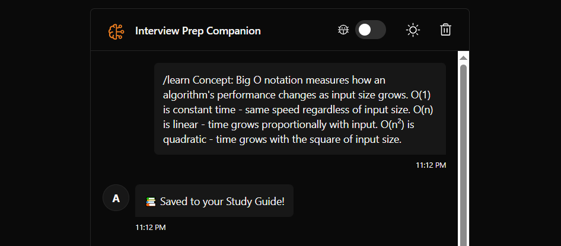
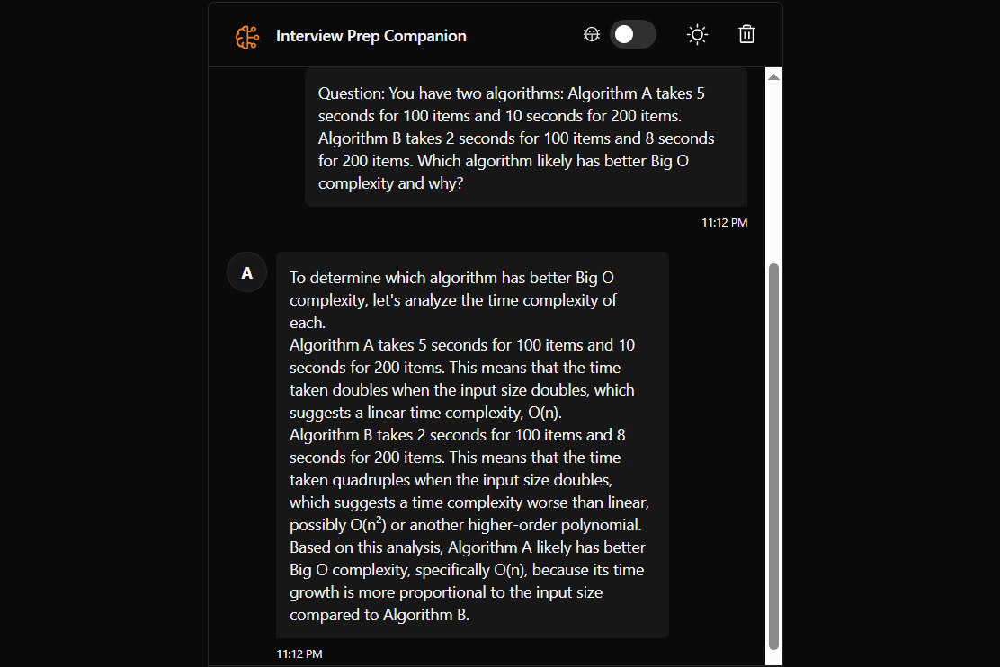

# Interview Prep Companion (`cf_ai_second_brain`)

A full-stack RAG (Retrieval Augmented Generation) agent built on Cloudflare Workers, Durable Objects, and Vectorize. It serves as a personalized "Interview Prep Companion" that helps students store and recall behavioral stories, algorithm patterns, and system design notes.

## 🚀 Live Demo
**[https://cf-ai-second-brain.rnazre.workers.dev](https://cf-ai-second-brain.rnazre.workers.dev)**


## 🛠️ Tech Stack
* **LLM:** Llama 3.3 70B (via Workers AI)
* **Coordination:** Durable Objects (managing chat state and agent logic)
* **Memory:** Cloudflare Vectorize (Vector Database) + BGE-M3 Embeddings
* **Frontend:** React + Vite (served via Worker Assets)
* **Language:** TypeScript
* **Evaluation:** Python (sentence-transformers, requests)

## ✨ Features
1.  **Mock Interviewer:** Real-time streaming chat with Llama 3.3, customized to act as a supportive technical interviewer.
2.  **Study Guide Mode:** Users can save specific notes (STAR method stories, LeetCode patterns) using the `/learn` command.
3.  **RAG / Memory:** The agent converts `/learn` inputs into vector embeddings (1024 dimensions) and stores them in Cloudflare Vectorize. When asked a question later, it retrieves the user's *specific* saved examples rather than generic advice.
4.  **Persistent History:** Chat sessions are managed by Durable Objects, ensuring state consistency.
5.  **Automated QA:** Includes a Python-based evaluation suite to regression test the agent's memory. 

## 🧠 Example Usage & Demo

The system is designed to retain complex technical details and recall them during mock interviews.

**1. Saving Knowledge (`/learn`)**
The user stores a definition or behavioral story into the Vectorize database.
> `/learn Concept: Big O notation...`



**2. Recalling & Reasoning**
The agent retrieves the stored definition to answer complex reasoning questions.
> **User:** "Which algorithm likely has better Big O complexity?"



## 🏃‍♂️ How to Run Locally

### Prerequisites
* Node.js & npm
* Cloudflare Wrangler CLI (`npm install -g wrangler`)
* Python 3.8+ (for running benchmarks)

### Installation
1.  **Clone the repository:**
    ```bash
    git clone [https://github.com/rukmini-17/cf_ai_second_brain.git](https://github.com/rukmini-17/cf_ai_second_brain.git)
    cd cf_ai_second_brain
    ```

2.  **Install dependencies:**
    ```bash
    npm install
    ```

3.  **Login to Cloudflare:**
    ```bash
    npx wrangler login
    ```

4.  **Setup Vector Database:**
    ```bash
    npx wrangler vectorize create second-brain-index --dimensions=1024 --metric=cosine
    ```

5.  **Run Development Server:**
    ```bash
    npm run dev
    ```
## 📊 Evaluation & Benchmarking
To ensure reliability and prevent hallucinations, I implemented an automated offline benchmarking pipeline.

* **Methodology:** A "Golden Dataset" of 12 ground-truth Q&A pairs covering Behavioral, Technical (ML/Security), and Personal domains.
* **Metric:** Semantic Similarity (Cosine Similarity) measured using the `all-MiniLM-L6-v2` embedding model.
* **Performance:** The system achieved an **overall accuracy of 90.3%**, with near-perfect retrieval for Resume facts (93.9%) and ML concepts (91.3%).

<p align="center">
  
</p>

You can reproduce these results by running the script in the `evaluation/` folder:
```bash
cd evaluation
pip install -r requirements.txt
python bulk_benchmark.py 
```
See [benchmark_results.csv](./evaluation/benchmark_results.csv) for the raw data.

## 📂 Project Structure
* `src/server.ts`: Main Worker and Durable Object logic (RAG implementation).
* `src/client.tsx`: React frontend.
* `evaluation/`: Python benchmarking scripts and datasets.
* `wrangler.jsonc`: Cloudflare configuration (Vectorize bindings, Assets).

## 🤖 AI Assistance
Prompts used during development are documented in [PROMPTS.md](./PROMPTS.md).